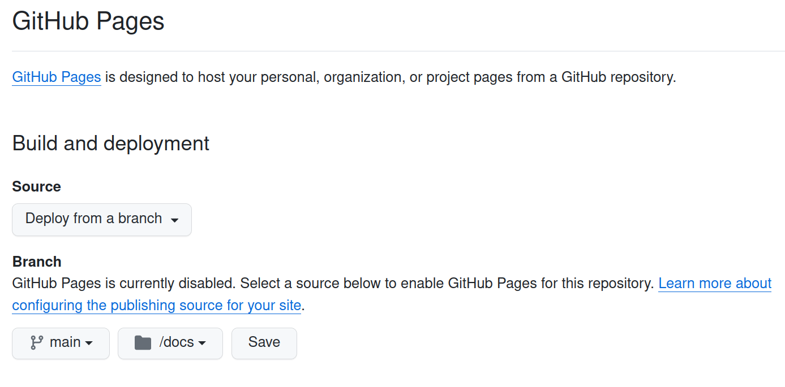
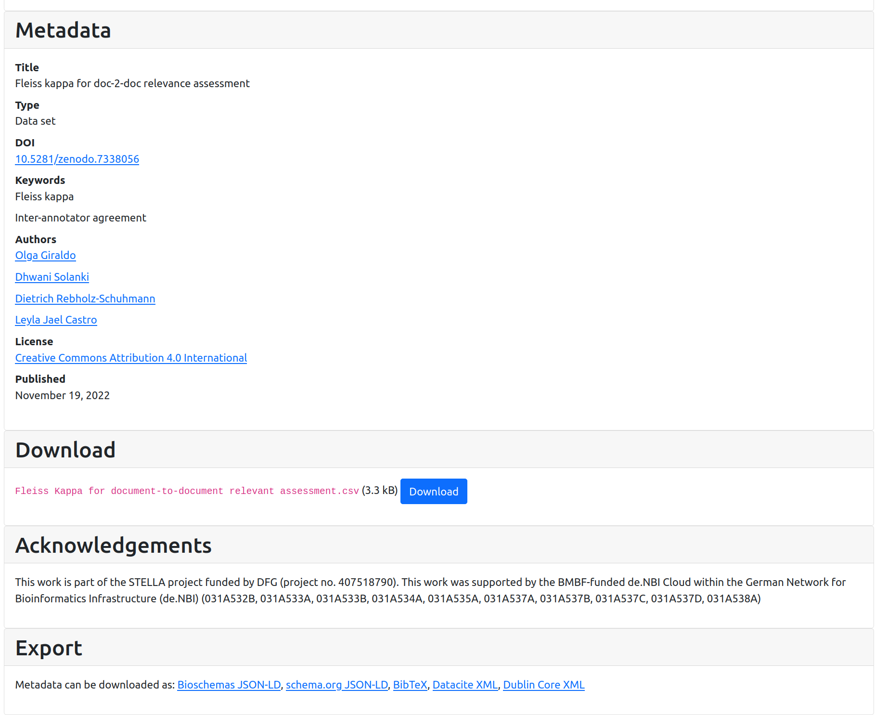

# signposting-tutorial

## Overview
* __Name:__ Tutorial on adding Signposting to HTML in Web pages
* __Description:__ This tutorial shows how to add Signposting to GitHub pages. It uses a simple GitHub page hosted in the `docs/` folder to create a sample project page, i.e., as learners could do with their own GitHub projects. As an example, it uses the dataset corresponding to the released project [TREC-doc-2-doc-relevance](https://github.com/zbmed-semtec/TREC-doc-2-doc-relevance), a web-based interface to add document-to-document relevance assessments to pairs of documents retrieved from [TREC 2005 Genomics Track](https://trec.nist.gov/data/genomics/05/genomics.qrels.large.txt). 
* __Keywords:__ Signposting, GitHub pages

 __Questions__
* How can I add Signposting to GitHub pages?
* How can I include external metadata in my signposting?
* How do I decide which metadata to include in signposting?

 __Learning outcomes__
* Describe how Signposting can be embedded in GitHub pages
* Understanding of Signposting limitation of static content-delivery networks
* Knowledge of different metadata formats and their signposting profiles
 

 __Requirements__
* Brief understanding of Signposting
* Familiarity on how to use GitHub 
* Basic knowledge on how to use GitHub pages. More information at [GitHub Pages](https://pages.github.com/)
* Familiarity with HTML
* Knowledge of developer tools on a browser

 __Time estimation__ 30 minutes

 __Level__ Beginner / Introductory

 __Published__ 2024-02-25

 __Latest modification__ 2024-02-25

 __License__ [CC-By 4.0](https://spdx.org/licenses/CC-BY-4.0)

 __Version__ 0.1.0

<!-- __Identifier__ [DOI:10.5281/zenodo.10629453](https://doi.org/10.5281/zenodo.10629453)

 __Citation__ Castro, LJ. (2024, February 7). Adding Bioschemas Dataset and ComputationalTool markup to GitHub pages. Zenodo. https://doi.org/10.5281/zenodo.10629453
-->

## Learning experience

### Agenda
In this tutorial we will cover:
- [signposting-tutorial](#signposting-tutorial)
  - [Overview](#overview)
  - [Learning experience](#learning-experience)
    - [Agenda](#agenda)
    - [Prerequisites](#prerequisites)
    - [Creating this GitHub Page](#creating-this-github-page)
    - [Overview of the repository](#overview-of-the-repository)
    - [Challenge of machine actionability](#challenge-of-machine-actionability)
    - [Adding FAIR Signposting](#adding-fair-signposting)
    - [Try it out](#try-it-out)
  - [What is next?](#what-is-next)
  - [Acknowledgements](#acknowledgements)

### Prerequisites

To follow this tutorial, you should already have experience with using GitHub, and be signed in to your GitHub account. See [Learn the basics of GitHub](https://docs.github.com/en/get-started/start-your-journey) as a refresher.

### Creating this GitHub Page

Let's start by forking [this repository](https://github.com/stain/signposting-tutorial) for your own purposes. Once forked, go to **Settings**

You will need to enable _Pages_ on your forked repository, and select **Deploy from a branch** using  **Branch:** `main`  and **Folder**: `docs/`. Then **Save** the changes. 

As this repo does have a gh-pages branch, it will use it. If such branch would not exist, GitHub would ask you to use the main branch to start the gh-pages one

In a matter of minutes, your site will be live. The pages corresponding to the examples used in this tutorial are available at [https://stain.github.io/signposting-tutorial/](https://stain.github.io/signposting-tutorial/)

Do not forget to check out a local copy of your fork so you can make changes -- alternatively you may use the GitHub editor.

### Overview of the repository

This repository is emulating a basic HTML-based institutional repository, with a single dataset entry corresponding to Zenodo's entry:

* [docs/](docs/) The Web root, as deployed above. Note that your deployment will use a hostname similar to `stain.github.io` but reflecting your username.
  - [docs/7338056/](docs/7338056/) A single dataset, based on a <a href="https://doi.org/10.5281/zenodo.7338056">real Zenodo entry</a>
    + [docs/7338056/index.html](docs/7338056/index.html) HTML for the dataset 7338056, at start of tutorial _without any signposting_
    + [docs/7338056/solution.html](docs/7338056/solution.html) Modified `index.html` after following this tutorial. Do not peek here until you have done the exercises!
    + [docs/7338056/bioschemas.jsonld](docs/7338056/bioschemas.jsonld) Bioschemas JSON-LD metadata as in the tutorial [bioschemas-ghpages-markup-tutorial](https://github.com/zbmed-semtec/bioschemas-ghpages-markup-tutorial), but extracted from `<script>` tag 

The remaining dataset and metadata downloads are in this case shown as deeplinks to Zenodo to indicate that Signposting is not tied to a particular domain.

Signposting is added at HTTP or HTML-level, and this tutorial is deployed using [GitHub Pages](https://pages.github.com/). For simplicity it uses static HTML files based on a [Bootstrap v5 starter template](https://getbootstrap.com/docs/5.0/getting-started/introduction) -- applying Signposting to a real repository deployment may require editing of its HTML templates, which is currently out of scope for this tutorial.

### Challenge of machine actionability

Look at HTML page <https://stain.github.io/signposting-tutorial/7338056/> and open the HTML code in [docs/7338056/index.html](docs/7338056/index.html). 
This is a somewhat typical _landing page_ for a Web-based data repository. We will imagine that the persistent identifier (DOI) has redirected to this page, as is the case for the original <https://doi.org/10.5281/zenodo.7338056>

We see that the landing page is quite useful for humans, including an abstract, metadata including title, author, keywords, and a big download button. There are some export formats listed at the end for formats like Bibtex.

The tutorial [bioschemas-ghpages-markup-tutorial](https://github.com/zbmed-semtec/bioschemas-ghpages-markup-tutorial) highlights how this kind of metadata can be made machine-readable in a FAIR format -- which for completeness is included in the `<script>` tag at the end of the HTML. This however just one of the many ways that FAIR metadata can be provided, and many repositories (as shown in this example).

However, a machine (example: pre-programmed script) who accesses the given persistent identifier, and do not already know this particular repository implementation or Bioschemas, is not immediately able to answer the most basic FAIR questions:

* What is the persistent identifier?
* What is the type of the resource described?
* Where can it download the data (if any), and in which format(s)?
* What is the license and authorship of the data?
* What other metadata formats are available? What conventions do they follow?

The goal of [Signposting](https://signposting.org/) is to reduce the heuristics that would otherwise be needed by such clients (e.g. text mining or content-negotiation), to give explicit typed links to facilitate _navigation_. Note that this is different from _semantics_, as the main goal is to give the client further waypoints rather than meaning.

### Adding FAIR Signposting

### Try it out

## What is next?

## Acknowledgements
This tutorial is based on [bioschemas-ghpages-markup-tutorial](https://github.com/zbmed-semtec/bioschemas-ghpages-markup-tutorial), [bioschemas-github-markup-example](https://github.com/zbmed-semtec/bioschemas-github-markup-example) and [Adding schema.org to a GitHub Pages site](https://bioschemas.org/tutorials/howto/howto_add_github).

LJC has received fundings from the [German Research Foundation (DFG)](https://www.dfg.de/en) via the grant for NFDI4DataScience No. [460234259](https://gepris.dfg.de/gepris/projekt/460234259)

We use free SVG icons from [Font Awesone](https://fontawesome.com/)
